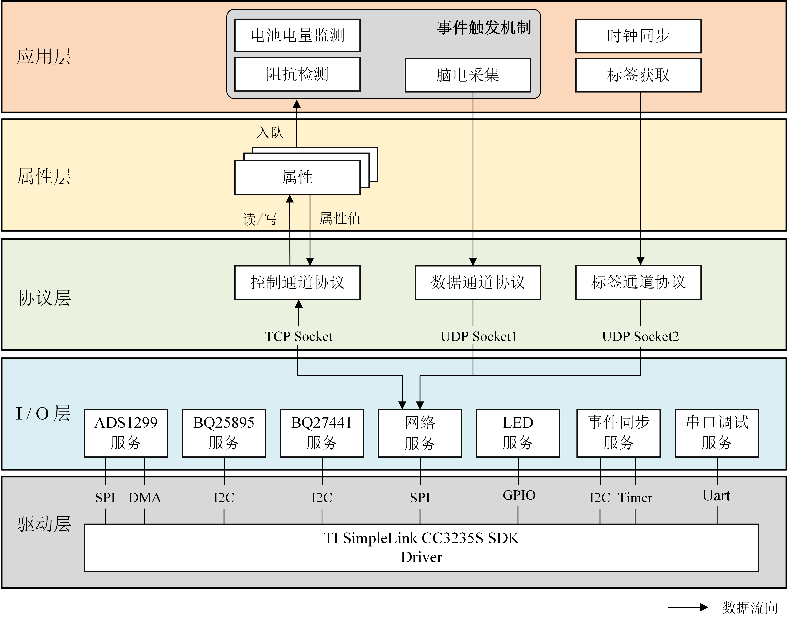

# NanoEEG_CC3235S 开发简介
## 开发环境
1. [Code Composer Studio™ Desktop IDE 最新版本](https://www.ti.com.cn/zh-cn/design-resources/embedded-development/ccs-development-tools.html#ide-desktop)
2. TI SimpleLink CC32XX SDK (5.30.00.08)

> 中文字体编码 UTF-8 通过`Properties->Resource->Text file encoding` 修改

## 软件架构

## 版本说明
|	版本号	|	功能描述	| 版本贡献 |
| :-------: | :-------	| :-------: |
| Version1.0.0 |  **脑电采集基本功能**   - 支持全局采样率修改   - 支持全局增益修改  | gjmsilly |